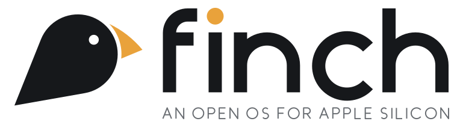

<p align="center">
  <picture>
    <source media="(prefers-color-scheme: dark)" srcset="branding/svg/logo-dark.svg">
    
  </picture>
</p>

<p align="center"><b>Darwin, evolved.</b> An open-source operating system for Apple Silicon Macs,<br>
built on Darwin/XNU, that aims to run Mac software.</p>

<p align="center"><i>Built in the open. For a more open tomorrow.</i></p>

## Status

Phase 2 of the [roadmap](docs/ROADMAP.md): the open graphics stack and the first app.
Finch is tested in emulation (an emulated M4 in QEMU) and in a Virtualization.framework
VM. Bare metal comes after the GUI stack.

- **Kernel:** Finch builds XNU (`xnu-12377.101.15`) from source and boots it. Apple's
  kexts are still borrowed until Phase 3's open drivers replace them.
- **Userland (Phase 1, done 2026-10-07):** the VM boots to a shell with no closed Apple
  binaries above the kernel. Finch's own PID 1, `finch-init`, is a launchd-compatible
  service manager and bootstrap server. dyld, libSystem, a Finch-built dyld shared cache,
  Finch's ABI-compatible libxpc, os_log via `finch-logd`, PAM logins, about 230
  commands, zsh and bash all run from source.
- **Nothing closed is borrowed** above the kernel (since 2026-10-08). Every library
  Finch builds links only Finch-built code (`tools/check-closed.py`). Closed pieces are
  built from Apple's open source or written by Finch as they come up.
- **Frameworks (Phase 2, in progress):** each is checked by test programs that print the
  same output against Apple's framework and Finch's.
  - CoreFoundation (swift-corelibs-foundation's CF plus Finch's Objective-C bridge),
    IOKit, OpenDirectory, libcompression and ICU are built from source.
  - Finch's own **Foundation** (about 130 of Apple's classes, URL resource values,
    Apple events registration) and **UniformTypeIdentifiers**.
  - **CoreGraphics** over [Skia](docs/design/COREGRAPHICS.md) (bitmap contexts, paths,
    images, gradients, patterns, text, PDF writing and reading), **ImageIO** over open
    codecs, and **CoreText** over HarfBuzz, FreeType and ICU, with open fonts in place of
    Apple's.
  - Finch's own **window server** ([design](docs/design/WINDOWSERVER.md)): windows over
    shared memory, a compositor, input routing, a host viewer.
  - Finch's own **AppKit** ([design](docs/design/APPKIT.md)) with UIFoundation under it:
    applications, windows, views, events, drawing, nibs, documents, controls, menus and a
    menu bar, text views, scrolling, printing to PDF.
  - **A Cocoa app runs:** `userland/tests/apps/Hello`, built the usual way (a nib from
    ibtool, `NSApplicationMain`), puts up its menu bar and window on Finch's window server
    and answers clicks and typing, on the host (`tools/run-app.sh`) and in the VM.
- **Next:** Swift overlays, Auto Layout, bindings, panels and TextKit 2, until Apple's
  TextEdit, unmodified, runs on Finch.

## Principles

1. **Built for the hardware.** Finch targets Apple Silicon only. There is no portability
   tax and no lowest-common-denominator drivers.
2. **Apple's open source first.** If Apple publishes it (XNU, libc, dyld, launchd,
   CoreFoundation, Security, WebKit, clang, and so on), we build from it.
3. **Diverge at the proprietary boundary.** Where Apple stops publishing, we write our
   own implementation, informed by public documentation and the Asahi Linux team's
   reverse engineering.
4. **Binary compatibility is the product.** The goal is for an unmodified `.app` from
   macOS to launch. Source compatibility is a fallback.
5. **Never redistribute Apple binaries.** During bootstrap, Finch may *load* proprietary
   components from the user's own macOS installation. It never ships them. Every one is
   a replacement target on the [roadmap](docs/ROADMAP.md).
6. **No Apple account features.** iCloud, App Store, iMessage, FaceTime and Apple ID are
   out of scope.

## Windows software

A later goal (roadmap Phase 6): run Windows applications through Wine, with an open
x86-64 translator (FEX-Emu / Box64) instead of Rosetta 2.

## Long-term

If Finch works on the Mac, the same base (kernel, drivers, frameworks) becomes the
foundation for an open replacement for iOS on iPhone/iPad hardware.

## Docs

- [Architecture](docs/ARCHITECTURE.md): the layer cake and where each piece comes from
- [Stack](docs/STACK.md): diagrams of what runs on Finch today and how it links
- [Roadmap](docs/ROADMAP.md): phased milestones with exit criteria
- [Licensing](docs/LICENSING.md): what we can import, from whom, and how
- [Hardware](docs/HARDWARE.md): target machines and the dev/test setup
- [Dev VM](docs/DEV_VM.md): emulated M4 for kernel/userland work
- [Tier 2 VM](docs/design/TIER2-VZ.md): the Virtualization.framework guest for graphics work
- [Brand](branding/BRAND.md): logo, colours and usage

Design notes, in `docs/design/`:

- [Phase 1 exit](docs/design/PHASE1-EXIT.md): how "no closed binaries above the kernel" is checked
- [XPC](docs/design/XPC.md): Finch's ABI-compatible libxpc
- [Services](docs/design/SERVICES.md): finch-init as a launchd-compatible service manager
- [dyld shared cache](docs/design/DYLD_CACHE.md): a Finch-built cache that makes process launch about 50× faster
- [Logging](docs/design/LOGD.md): os_log and `log` over libdispatch's firehose
- [CoreFoundation](docs/design/COREFOUNDATION.md): CF from swift-corelibs, and closed dependencies removed
- [Foundation](docs/design/FOUNDATION.md): Finch's Foundation and CF's Objective-C half
- [CoreGraphics](docs/design/COREGRAPHICS.md): CoreGraphics, CoreText and ImageIO over Skia, FreeType and HarfBuzz
- [POSIX](docs/design/POSIX.md): the conformance target

## Layout

```
boot/          boot chain: kernel collection tooling (m1n1 integration later)
kernel/        XNU (vendored from apple-oss-distributions) + Finch patches
userland/      everything above the kernel: Darwin built from Apple's open source,
               Finch's own libraries and daemons, and the frameworks
               (CoreFoundation, Foundation, IOKit, ...), each with its build script
drivers/       open kexts replacing Apple's closed platform drivers (Phase 3)
desktop/       Finch's desktop shell (Phase 2; the window server is userland/WindowServer)
tools/         build system, VM tooling, checks (closed-library, API coverage)
branding/      logo, icons, colours
third_party/   imported non-Apple projects and their patches (darwin-vm, ...)
docs/          design docs
```

## License

Finch's own code is dual-licensed under [MIT](LICENSE-MIT) or [Apache-2.0](LICENSE-APACHE),
at your option. Changes to Apple's open-source files keep Apple's license (APSL-2.0). See
[docs/LICENSING.md](docs/LICENSING.md).
