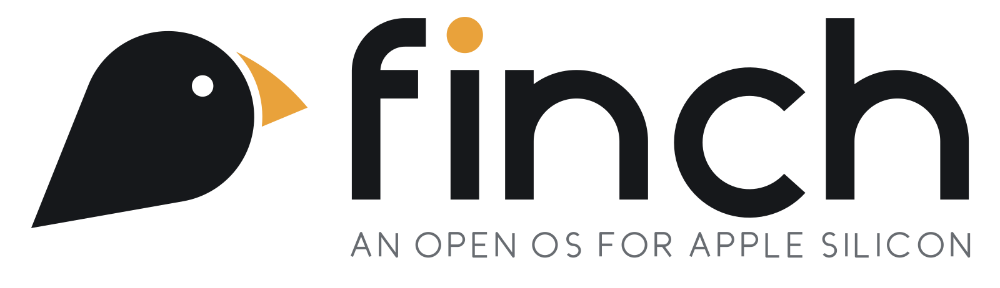

<p align="center">
  <picture>
    <source media="(prefers-color-scheme: dark)" srcset="branding/logo-dark.png">
    
  </picture>
</p>

<p align="center"><b>Darwin, evolved.</b> An open-source operating system for Apple Silicon Macs,<br>
built on Darwin/XNU, that aims to run Mac software.</p>

<p align="center"><i>Built in the open. For a more open tomorrow.</i></p>

## Status

Early development (Phase 1 of the [roadmap](docs/ROADMAP.md)). On an emulated M4, Finch
boots its own XNU build and its own PID 1 (`finch-init`), and runs a userland built from
Apple's open source, including zsh, bash, about 230 core commands and `libsystem_kernel`.
Real hardware is next.

## Principles

1. **Built for the hardware.** Finch targets Apple Silicon only. There is no portability
   tax and no lowest-common-denominator drivers.
2. **Apple's open source first.** If Apple publishes it (XNU, libc, dyld, launchd,
   CoreFoundation, Security, WebKit, clang, and so on), we build from it.
3. **Diverge at the proprietary boundary.** Where Apple stops publishing, we write our
   own implementation, informed by public documentation and the Asahi Linux team's
   reverse engineering.
4. **Binary compatibility is the product.** The goal is for an unmodified `.app` from
   macOS to launch. Source compatibility is a fallback.
5. **Never redistribute Apple binaries.** During bootstrap, Finch may *load* proprietary
   components from the user's own macOS installation. It never ships them. Every one is
   a replacement target on the [roadmap](docs/ROADMAP.md).
6. **No Apple account features.** iCloud, App Store, iMessage, FaceTime and Apple ID are
   out of scope.

## Windows software

A later goal (roadmap Phase 6): run Windows applications through Wine, with an open
x86-64 translator (FEX-Emu / Box64) instead of Rosetta 2.

## Long-term

If Finch works on the Mac, the same base (kernel, drivers, frameworks) becomes the
foundation for an open replacement for iOS on iPhone/iPad hardware.

## Docs

- [Architecture](docs/ARCHITECTURE.md): the layer cake and where each piece comes from
- [Roadmap](docs/ROADMAP.md): phased milestones with exit criteria
- [Licensing](docs/LICENSING.md): what we can import, from whom, and how
- [Hardware](docs/HARDWARE.md): target machines and the dev/test setup
- [Dev VM](docs/DEV_VM.md): emulated M4 for kernel/userland work
- [Brand](branding/BRAND.md): logo, colours and usage
- [XPC design](docs/design/XPC.md): Finch's ABI-compatible libxpc
- [Services](docs/design/SERVICES.md): finch-init as launchd-compatible service manager

## Layout

```
boot/          boot chain: m1n1 integration, kernel collection tooling
kernel/        XNU (vendored from apple-oss-distributions) + Finch patches
drivers/       open kexts replacing Apple's closed platform drivers
userland/      Darwin userspace built from Apple open source
frameworks/    Foundation/AppKit/etc. compatibility layer
desktop/       Finch's window server, compositor, shell
tools/         build system, image builder, host-side utilities
branding/      logo, icons, colours
third_party/   imported non-Apple projects (Mesa, m1n1, …)
docs/          design docs
```

## License

Finch's own code is dual-licensed under [MIT](LICENSE-MIT) or [Apache-2.0](LICENSE-APACHE),
at your option. Changes to Apple's open-source files keep Apple's license (APSL-2.0). See
[docs/LICENSING.md](docs/LICENSING.md).
