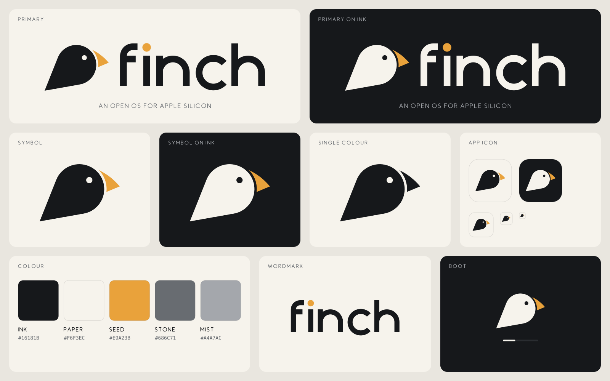
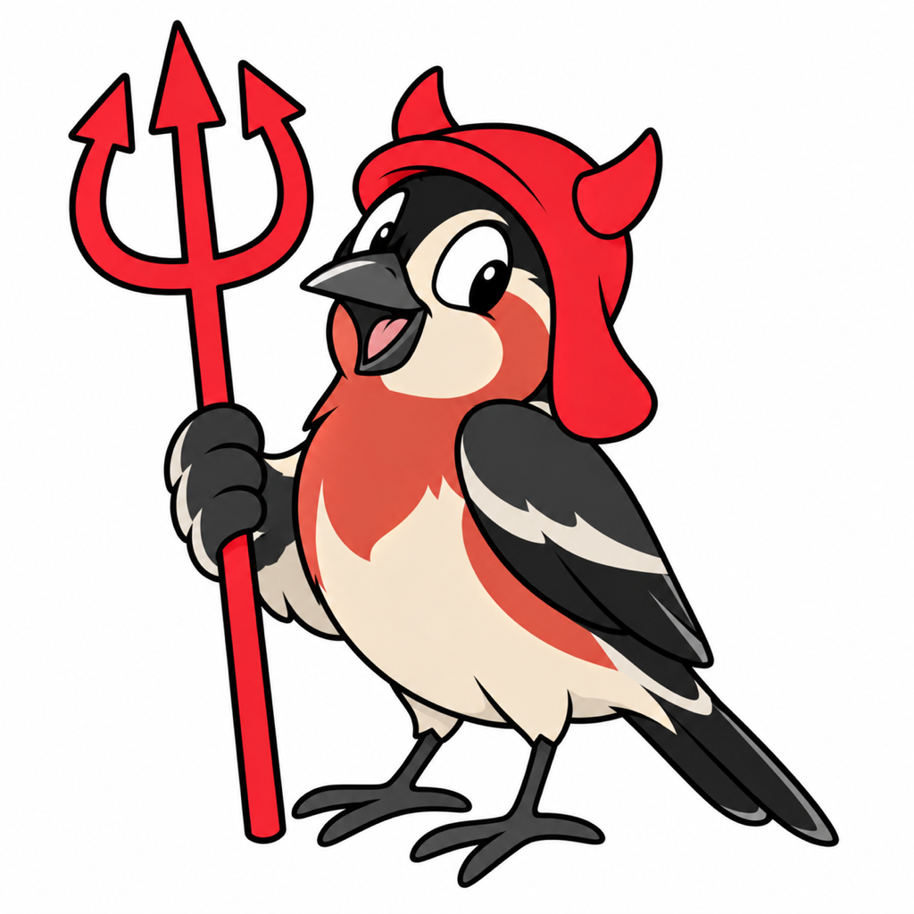

# Finch brand

**Finch: an open OS for Apple Silicon.**
*Built in the open, for a more open tomorrow.*

## The mark

A Darwin's finch: the finches whose beaks adapted to each island, for an OS built on
Darwin that adapts to run another system's software. The bird is built from geometry,
with no hand-drawn curves:

- **Body:** one circle for the head and body. The tail is the wedge formed by the
  circle's two tangents to a point at the lower left.
- **Beak:** the stout, conical seed-cracker that sets a finch apart. It sits off the
  head behind a small gap and is the only Seed-coloured part.
- **Eye:** a hole, not a painted dot, so the mark works on any background.

The wordmark is lowercase **finch** in Finch's own monoline letters (22-unit stroke,
geometric arches, a flat-cut `c`). The dot of the `i` is a Seed: it echoes the beak and
is the only colour in the wordmark. The tagline uses the same construction in thin,
widely spaced capitals. No font is involved anywhere, so the brand carries no font
licence.

## Name

- In prose it's **Finch**, and the wordmark is lowercase **finch**. The OS is "Finch" or
  "Finch OS", never "FinchOS".
- The tagline is **An open OS for Apple Silicon**.
- "Apple Silicon", "Mac" and "macOS" describe compatibility only. Never put Apple's logos
  or artwork next to the Finch mark, and never imply endorsement.

## Colours

| Name | Hex | Use |
|---|---|---|
| Ink | `#16181B` | Mark and wordmark on light backgrounds, dark backgrounds |
| Paper | `#F6F3EC` | Light backgrounds, mark and wordmark on Ink |
| Seed | `#E9A23B` | The beak and the dot of the `i`. Use it as an accent, never for text |
| Stone | `#686C71` | Secondary text on Paper (4.8:1) |
| Mist | `#A4A7AC` | Secondary text on Ink (7.4:1) |

Seed on Paper is only about 2:1, so don't use it for text or thin lines. Keep it for
the beak, the dot, focus rings on Ink, and progress fills.

Terminal (24-bit) equivalents, used by finch-init's boot banner:
Paper `\e[38;2;246;243;236m`, Seed `\e[38;2;233;162;59m`, Mist `\e[38;2;164;167;172m`.

## Usage

- Clear space around the mark: at least the eye-to-beak distance (about ⅓ of the mark's
  height) on every side.
- Minimum size: 16 px for the symbol, 80 px wide for the horizontal logo.
- One-colour use: `svg/symbol-mono*.svg` and `svg/logo-mono.svg` paint the beak in the
  mark's colour. Use them for print, engraving, and anywhere only one colour is
  available.
- Don't rotate, outline, add a gradient or shadow to, or recolour the mark (beyond the
  Ink/Paper swap and the one-colour version). Don't put a Paper mark on a light photo.

## Assets

Everything is generated by `tools/mkbrand.py` from geometry defined in that script. To
change the brand, edit the script and re-run it. Never edit the outputs by hand.

| File | What |
|---|---|
| `svg/logo.svg`, `svg/logo-dark.svg`, `svg/logo-mono.svg` | Horizontal logo: mark, wordmark and tagline (masters) |
| `svg/logo-stacked.svg`, `svg/logo-stacked-dark.svg` | Stacked logo |
| `svg/wordmark.svg`, `svg/wordmark-dark.svg` | Wordmark alone |
| `svg/symbol*.svg` | The bird alone: colour, on Ink, one-colour |
| `svg/icon.svg`, `svg/icon-dark.svg` | App icon masters (1024 grid) |
| `svg/boot.svg`, `svg/boot-logo.svg` | Boot splash (2560×1664 master) and the bare boot mark |
| `svg/social-preview.svg`, `svg/brand-sheet.svg` | Social card and brand sheet |
| `logo.png`, `logo-dark.png` | Horizontal logo, 1600 px wide, transparent |
| `symbol.png`, `symbol-dark.png` | The bird, 1024², transparent |
| `icons/icon-<n>.png`, `icons/icon-dark-<n>.png` | App icons, 16–1024 px. 16 and 32 use a tighter tile |
| `icons/Finch.icns`, `icons/favicon.ico` | macOS icon bundle, favicon (16–64 px) |
| `boot/boot-<w>x<h>.png` | Full-screen boot splashes for Apple Silicon panels and 4K/5K displays |
| `boot/boot-logo.png`, `@2x`, `@3x` | Transparent boot mark (128/256/384 px) for code that draws its own background |
| `social-preview.png` | 1280×640 GitHub / social card |
| `brand-sheet.png` | The full brand sheet |
| `mascot.png` | The mascot (1024², hand-drawn, not generated) |

The generator also writes `userland/finch-init/banner_art.h`, the console version of
the mark.

## Boot

- **Splash:** the Paper bird on Ink, centred a little above the middle, with a thin
  progress track below it. The mark is 18% of the screen's shorter side, so it looks the
  same on a MacBook panel and a 5K display. The track is Line `#2A2D31` and the fill is
  Paper. Nothing else goes on the screen.
- **Console:** finch-init prints the mark in 24-bit half-block characters, with the
  wordmark and tagline beside it, then its version and the kernel banner.
- On real hardware, Apple's iBoot draws its own logo before the kernel starts. Finch
  doesn't replace or cover it. Finch's splash belongs to the stages Finch owns: the
  kernel console and everything after.
- Finch **does not** change `SystemVersion.plist`'s `ProductName` (`macOS`). Mac apps read
  it for compatibility checks. Finch identifies itself in the kernel banner
  (`finch:finch-<version>/…`) and in its own components instead.

## Mascot

The mascot is a finch wearing a red devil hood and holding a trident. It's a nod to the
BSD daemon, since Darwin's userland grew out of BSD. Use it for informal places: the
README, talks, stickers, release notes, error pages and "fun" moments. The logo stays
the formal mark, so don't use the mascot in place of the logo or the app icon.

- The mascot's red (`#E8262E`, approx.) belongs to the mascot only. It isn't a UI or
  brand colour.
- Don't recolour the bird, crop off the trident, or add Apple imagery.
- It was drawn after the BSD daemon, but it is its own character. Never use the BSD
  daemon artwork itself.
