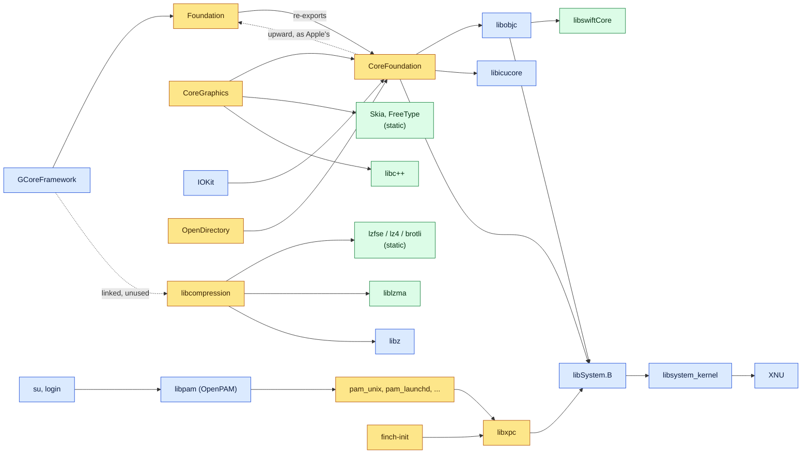

# Finch software stack

What runs on Finch today and where each piece comes from, bottom to top.
`docs/ARCHITECTURE.md` explains the layers. `docs/ROADMAP.md` covers what comes next.
These diagrams are updated in every commit that changes the stack, and
`tools/render-stack.sh` checks that they render.

**As of 2026-10-08:** nothing Finch builds links a closed library
(`tools/check-closed.py`). Finch's own Foundation covers about 100 of Apple's
classes, on a CoreFoundation that dispatches to Objective-C objects as Apple's
does (`docs/design/FOUNDATION.md`). Finch's CoreGraphics has begun, over Skia
(`docs/design/COREGRAPHICS.md`): bitmap contexts draw paths, images,
clips, shadows and transparency layers as Apple's do.

```mermaid
block-beta
    columns 1
    block:L7
        columns 4
        t7["Apps and desktop"]
        apps["Unmodified Mac apps"]
        desktop["Window server, compositor"]
        shell["Dock / Finder-alikes"]
    end
    block:L6
        columns 4
        t6["App frameworks"]
        appkit["AppKit"]
        cg["CoreGraphics<br/>bitmap contexts, paths, images,<br/>colour spaces, clipping, shadows,<br/>layers (over Skia, skcms)"]
        ctio["CoreText, ImageIO"]
        space6[" "]
        later["QuartzCore, Metal, SwiftUI, AV"]
        space6b[" "]
        space6c[" "]
    end
    block:L5
        columns 4
        t5["Foundation layer"]
        foundation["Foundation<br/>strings, numbers, decimals, threads,<br/>files, bundles, formatters, queues,<br/>KVC/KVO, JSON, archiving, regexes,<br/>attributed strings, map/hash tables,<br/>undo, proxies, transforms,<br/>file handles, pipes, tasks,<br/>predicates, progress, file wrappers"]
        cf["CoreFoundation<br/>swift-corelibs CF + Finch ObjC:<br/>toll-free dispatch, collections,<br/>ordered sets, NSCache, NSData, NSDate,<br/>NSURL, locales, calendars, defaults,<br/>run loops, attributed strings,<br/>streams, Mach ports"]
        od["OpenDirectory<br/>CFOpenDirectory"]
        space5[" "]
        icu["libicucore<br/>ICU-76142.4.7"]
        objc["libobjc (objc4)"]
        swift["libswiftCore 6.3.1"]
        space5b[" "]
        iokit["IOKit.framework<br/>(IOKitUser)"]
        gcore["GCoreFramework<br/>(gcore, on Finch Foundation)"]
        space5c[" "]
    end
    block:L4
        columns 4
        t4["Libraries"]
        comp["libcompression<br/>LZFSE, LZ4, Brotli, zlib, LZMA"]
        codecs["lzfse, lz4, brotli,<br/>liblzma, libxo, libsbuf"]
        osslibs["zlib, bzip2, libedit, libresolv,<br/>libiconv, ncurses, OpenBSM"]
        space4[" "]
        pam["OpenPAM + pam_modules"]
        pamunix["pam_unix, Finch pam.d"]
        ess["libEndpointSecuritySystem"]
        space4b[" "]
        tz["tzdata 2026c (IANA)"]
        skia["Skia m155 + FreeType, libpng,<br/>libjpeg-turbo, libwebp, wuffs<br/>(static, for CoreGraphics)"]
        space4d[" "]
    end
    block:L3
        columns 4
        t3["libSystem"]
        libc["Libc, libmalloc, libpthread,<br/>libplatform, libdispatch, Libinfo,<br/>Libnotify, asl, copyfile"]
        kernlib["libsystem_kernel<br/>(libsyscall)"]
        dyld["dyld + Finch shared cache"]
        space3[" "]
        xpc["libxpc<br/>Apple's wire protocol"]
        cc["libcorecrypto<br/>over OpenSSL 3.5.9"]
        stubs["libsystem_* (sandbox, trace,<br/>featureflags, quarantine...), libm"]
        space3b[" "]
        cxx["libc++, compiler-rt<br/>(LLVM runtimes)"]
        space3c[" "]
        space3d[" "]
    end
    block:L2
        columns 4
        t2["Processes"]
        init["finch-init (PID 1)<br/>bootstrap server,<br/>system + user domains"]
        logd["finch-logd, launchctl,<br/>sh, mount_tmpfs, devtools"]
        daemons["notifyd, syslogd, aslmanager,<br/>newsyslog, dynamic_pager, atrun"]
        space2[" "]
        cmds["file/shell/text/adv/system_cmds,<br/>bash, zsh, bc, su, login"]
        space2b[" "]
        space2c[" "]
    end
    block:L1
        columns 4
        t1["Kernel"]
        xnu["XNU xnu-12377.101.15<br/>+ Finch patches"]
        kexts["Platform drivers<br/>(Finch's later)"]
        space1[" "]
    end
    block:L0
        columns 4
        t0["Machines"]
        qemu["Tier 1: QEMU darwin-vm"]
        vz["Tier 2: Virtualization.framework<br/>guest, own kernel"]
        metal["Tier 3: M4 bare metal<br/>(deferred)"]
    end

    classDef layer fill:#111827,stroke:#111827,color:#ffffff,font-weight:bold
    classDef apple fill:#dbeafe,stroke:#1d4ed8,color:#0b1b3f
    classDef finch fill:#fde68a,stroke:#b45309,color:#3b2300
    classDef upstream fill:#dcfce7,stroke:#15803d,color:#052e12
    classDef planned fill:#f3f4f6,stroke:#9ca3af,color:#6b7280,stroke-dasharray:4 3
    classDef firmware fill:#fee2e2,stroke:#b91c1c,color:#450a0a
    classDef blank fill:none,stroke:none
    class t7,t6,t5,t4,t3,t2,t1,t0 layer
    class apps,desktop,shell,appkit,ctio,later,kexts,metal planned
    class cg,cf,foundation,od,comp,pamunix,ess,xpc,cc,stubs,init,logd finch
    class icu,objc,iokit,gcore,osslibs,pam,libc,kernlib,dyld,daemons,cmds,xnu apple
    class swift,codecs,cxx,qemu,tz,skia upstream
    class vz firmware
    class space6,space6b,space6c,space5,space5b,space5c,space4,space4b,space4d,space3,space3b,space3c,space3d,space2,space2b,space2c,space1 blank
```

| Colour | Meaning |
|---|---|
| Blue | Apple's open source, built by Finch (pinned tags, `userland/projects.txt`) |
| Yellow | Written by Finch |
| Green | Third-party upstream, built by Finch |
| Red | Apple firmware or boot chain, used as shipped (never redistributed) |
| Grey, dashed | Planned |

## How the libraries link

The edges are load-time links (`otool -L`). Foundation's link is the upward
link Apple's CoreFoundation also has.

