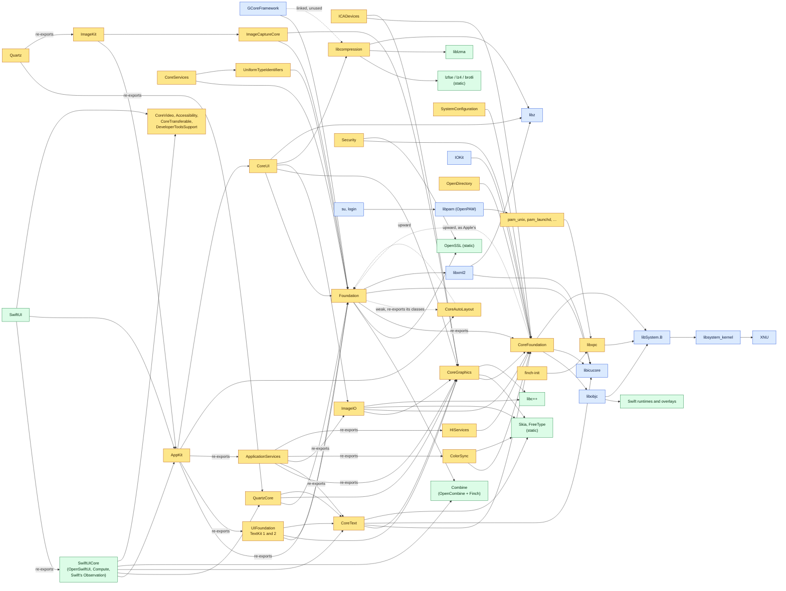

# Finch software stack

What runs on Finch today and where each piece comes from, bottom to top.
`docs/ARCHITECTURE.md` explains the layers. `docs/ROADMAP.md` covers what comes next.
These diagrams are updated in every commit that changes the stack, and
`tools/render-stack.sh` checks that they render.

**As of 2026-10-10:** nothing Finch builds links a closed library
(`tools/check-closed.py`). Finch's own Foundation covers about 130 of Apple's
classes, on a CoreFoundation that dispatches to Objective-C objects as Apple's
does (`docs/design/FOUNDATION.md`); its NSXMLParser runs on Apple's libxml2,
built by Finch. Finch's CoreGraphics has begun, over Skia
(`docs/design/COREGRAPHICS.md`): bitmap contexts draw paths, images,
clips, shadows and transparency layers as Apple's do, PDF contexts write
through Skia's PDF backend, and Finch's own parser reads and draws PDF. Finch's ImageIO reads
PNG, JPEG, GIF, BMP, ICO and WebP and writes PNG and JPEG over the open
codecs Skia builds, and reads and writes TIFF with its own codec, returning the CGImages and properties Apple's does. CoreText lays out text with HarfBuzz, FreeType and ICU, as Apple's does,
in open fonts Finch ships in place of Apple's (Inter for the system
font, Open Runde for rounded text, Fragment Mono for SF Mono, XCharter for
Charter, and TeX Gyre Pagella for Palatino). Liberation stays for Helvetica,
Arial, Times and Courier; DejaVu for Menlo; Noto for other scripts and emoji.
DejaVu bold fills SF Mono's bold styles, which Fragment Mono lacks.
Finch's window server composites windows that apps draw with CoreGraphics
into shared memory, and routes input to them (`docs/design/WINDOWSERVER.md`).
Finch's AppKit (`docs/design/APPKIT.md`), split as Apple's is with a private
UIFoundation under it, runs windows on that server: views draw, events reach
them, nibs and storyboards load, and full-size content windows show their title
bars and nib-loaded toolbars. `NSTextView` uses TextKit 2 by default, with TextKit 1
available. Auto Layout solves constraints with Finch's own Cassowary solver, in
a private CoreAutoLayout that Foundation re-exports. Cocoa bindings, controllers,
alerts, sheets, open/save panels and NSWorkspace work. Their comparison tests,
including TextKit 2 and Auto Layout, match Apple's on the host and in the VM.
AppKit and the window server draw in Fieldwork, Finch's own design language
(`docs/design/FIELDWORK.md`), from a theme file of tokens; the Classic theme keeps
Aqua-compatible values for apps that need them and for the comparison tests.
Combine is open code (OpenCombine with Finch's additions) built to Apple's ABI
(`docs/design/COMBINE.md`). SwiftUI is built from OpenSwiftUI, renamed to Apple's
modules, on Compute's attribute graph and the Swift runtime's Observation (apps'
`@Observable` types work with it); an unmodified SwiftUI app built with Xcode draws
its window on Finch's frameworks (`docs/design/SWIFTUI.md`); the frameworks it links that Apple keeps closed are Finch's own:
CoreVideo's display link, Accessibility, CoreTransferable and DeveloperToolsSupport. Terminal's need brought
CoreAudio (no devices until there's an audio driver), AudioToolbox's system sounds, Carbon with HIToolbox's
Carbon events and key translation, CoreAnalytics (which collects nothing), libScreenReader and
ColorSync (ICC profiles, Apple's named ones written by Finch, and transforms over skcms),
HIServices (the accessibility client API, which reports no trust until Finch has an
accessibility server, Universal Access settings and the Process Manager) and
DataDetectorsCore (links, addresses, phone numbers and IP addresses found in text). With them, every symbol
Terminal imports on arm64 resolves against Finch's frameworks. Foundation carries the URL loading system that Apple keeps in
the closed CFNetwork: file, data and HTTP(S) loading over OpenSSL. The desktop's frame is the Instrument Bar (each app's menu bar) and the Rail, a
Finch app down the left edge that replaces the Dock.

CoreFoundation's local notification center shares observers with Foundation's
default `NSNotificationCenter`. Bundles read `.loctable` files and choose their
language using `AppleLanguages` and Apple's ICU matching. QuartzCore has layers
drawn through CoreGraphics, and AppKit's views can be layer-backed, animation objects and transactions. The layer test
matches Apple's on the host and in the VM; on-screen animation playback still
needs a render server.

CoreServices now includes local app lookup and launching, Apple event values
and local handlers, and filesystem helpers (`docs/design/CORESERVICES.md`).
CoreUI reads compiled asset catalogs for AppKit's named colors and images
(`docs/design/ASSETS.md`). Foundation also contains its Swift value types and
bridges, built from pinned Swift Foundation and Swift Collections sources.
The Darwin Swift overlays and AppKit's first Swift extensions build alongside it.
Security supplies keys, certificates and caller-root trust checks over OpenSSL.
SystemConfiguration reads local preferences and network state. Keychain,
authorization and configd services remain unfinished (`docs/design/SECURITY.md`).

Image Capture's frameworks are Finch's own
(`docs/design/IMAGECAPTURE.md`): ImageCaptureCore's browser finds no cameras or
scanners yet, and Quartz re-exports QuartzCore and ImageKit's device views
(PDFKit and Quick Look come later). The unmodified Image Capture app launches
on the host with Finch's frameworks and headless window server. It shows English
strings, its title bar, an empty toolbar and an empty device list. The framework
comparison also passes in the VM; the Tier 2 display and input work remains.

```mermaid
block-beta
    columns 1
    block:L7
        columns 4
        t7["Apps and desktop"]
        apps["Image Capture (unmodified)<br/>launches with Finch frameworks<br/>on the host; no devices yet"]
        desktop["finch-windowserver<br/>windows over shared memory,<br/>Skia compositor, cursor,<br/>input routing (headless, viewer)"]
        shell["Fieldwork shell: the Rail<br/>(pinned and running apps,<br/>workbench switcher);<br/>file manager to come"]
    end
    block:L6
        columns 4
        t6["App frameworks"]
        appkit["AppKit<br/>apps, windows, views, events,<br/>title bars, nib-loaded toolbars,<br/>drawing, nibs, storyboards,<br/>Auto Layout, stack views, text views and<br/>scrolling, tables, outlines and<br/>collection views, menus and a menu bar,<br/>alerts, sheets, open and save panels,<br/>NSWorkspace (on the window server);<br/>Cocoa bindings and controllers,<br/>font and color panels, search/token/date controls,<br/>grids, popovers, drawers and rule editors;<br/>rulers, the find bar, text tables;<br/>animation groups and Touch Bar state;<br/>Fieldwork theme (Classic for Aqua compatibility);<br/>UIFoundation: fonts, string drawing,<br/>TextKit 1 and 2; Cocoa and<br/>ApplicationServices umbrellas"]
        cg["CoreGraphics<br/>bitmap contexts, paths, images,<br/>gradients, patterns, fonts, text,<br/>shadows (over Skia, skcms);<br/>PDF writing (SkPDF), PDF reading<br/>and drawing (own parser);<br/>window server client, displays"]
        imageio["ImageIO<br/>image sources, thumbnails,<br/>destinations, property keys<br/>(libpng, libjpeg-turbo, libwebp,<br/>wuffs, via Skia); TIFF (own codec)"]
        space6[" "]
        ctio["CoreText<br/>fonts, shaping, lines, frames<br/>(HarfBuzz, FreeType, ICU)"]
        quartzcore["QuartzCore<br/>layers drawn through CoreGraphics,<br/>animation objects, transactions;<br/>animation playback still to come"]
        imagecap["ImageCaptureCore (device<br/>browser, finds no devices yet),<br/>ICADevices; Quartz umbrella<br/>with ImageKit's device views"]
        space6b[" "]
        coreservices["CoreServices<br/>app lookup and launch,<br/>local Apple events, files"]
        later["Metal, AV"]
        coreui["CoreUI<br/>compiled asset catalogs,<br/>named images and colors"]
        appsupport["CoreVideo (display link),<br/>Accessibility, CoreTransferable,<br/>DeveloperToolsSupport; CoreAudio,<br/>AudioToolbox (system sounds),<br/>Carbon/HIToolbox (events, keys),<br/>CoreAnalytics, libScreenReader;<br/>ColorSync (profiles, transforms);<br/>HIServices (AX client, Process Manager),<br/>DataDetectorsCore (links in text)"]
        swiftui["SwiftUI, SwiftUICore<br/>(OpenSwiftUI on Compute's<br/>attribute graph; first app draws)"]
    end
    block:L5
        columns 4
        t5["Foundation layer"]
        foundation["Foundation<br/>strings, numbers, decimals, threads,<br/>files, bundles, formatters, queues,<br/>KVC/KVO, JSON, archiving, regexes,<br/>attributed strings, map/hash tables,<br/>undo, proxies, transforms,<br/>file handles, pipes, tasks,<br/>predicates, progress, file wrappers,<br/>units and measurements, XML parsing,<br/>URL resource values, NSXPCConnection,<br/>URL loading (HTTP/1.1, TLS via OpenSSL)"]
        uti["UniformTypeIdentifiers<br/>UTType, declared and<br/>dynamic types"]
        cf["CoreFoundation<br/>swift-corelibs CF + Finch ObjC:<br/>toll-free dispatch, collections,<br/>ordered sets, NSCache, NSData, NSDate,<br/>NSURL, locales, calendars, defaults,<br/>run loops, attributed strings,<br/>streams, Mach ports, notifications;<br/>bundle languages and .loctable files"]
        security["Security<br/>keys, certificates, caller-root trust<br/>(OpenSSL); services to come"]
        od["OpenDirectory<br/>CFOpenDirectory"]
        icu["libicucore<br/>ICU-76142.4.7"]
        objc["libobjc (objc4)"]
        autolayout["CoreAutoLayout (private)<br/>constraints, anchors, VFL,<br/>Cassowary solver"]
        swift["Swift 6.3.1 runtimes<br/>Darwin overlays,<br/>Foundation and AppKit Swift;<br/>Combine (OpenCombine + Finch)"]
        iokit["IOKit.framework<br/>(IOKitUser)"]
        gcore["GCoreFramework<br/>(gcore, on Finch Foundation)"]
        sysconfig["SystemConfiguration<br/>preferences and network reads;<br/>configd service to come"]
    end
    block:L4
        columns 4
        t4["Libraries"]
        comp["libcompression<br/>LZFSE, LZ4, Brotli, zlib, LZMA"]
        codecs["lzfse, lz4, brotli,<br/>liblzma, libxo, libsbuf"]
        osslibs["zlib, bzip2, libedit, libresolv,<br/>libiconv, ncurses, OpenBSM,<br/>libxml2"]
        space4[" "]
        pam["OpenPAM + pam_modules"]
        pamunix["pam_unix, Finch pam.d"]
        ess["libEndpointSecuritySystem"]
        space4b[" "]
        tz["tzdata 2026c (IANA)"]
        skia["Skia m155 + FreeType, HarfBuzz,<br/>libpng, libjpeg-turbo, libwebp, wuffs<br/>(static, for CoreGraphics,<br/>ImageIO and ColorSync)"]
        fonts["Open fonts (data, not code)<br/>Inter, Open Runde, Fragment Mono,<br/>XCharter, Pagella, Liberation, DejaVu,<br/>Noto for other scripts and emoji,<br/>in place of Apple's, which can't ship"]
    end
    block:L3
        columns 4
        t3["libSystem"]
        libc["Libc, libmalloc, libpthread,<br/>libplatform, libdispatch, Libinfo,<br/>Libnotify, asl, copyfile"]
        kernlib["libsystem_kernel<br/>(libsyscall)"]
        dyld["dyld + Finch shared cache"]
        space3[" "]
        xpc["libxpc<br/>Apple's wire protocol"]
        cc["libcorecrypto<br/>over OpenSSL 3.5.9"]
        stubs["libsystem_* (sandbox, trace,<br/>featureflags, quarantine...), libm"]
        space3b[" "]
        cxx["libc++, compiler-rt<br/>(LLVM runtimes)"]
        space3c[" "]
        space3d[" "]
    end
    block:L2
        columns 4
        t2["Processes"]
        init["finch-init (PID 1)<br/>bootstrap server,<br/>system + user domains"]
        logd["finch-logd, launchctl,<br/>sh, mount_tmpfs, devtools"]
        daemons["notifyd, syslogd, aslmanager,<br/>newsyslog, dynamic_pager, atrun"]
        space2[" "]
        cmds["file/shell/text/adv/system_cmds,<br/>bash, zsh, bc, su, login"]
        space2b[" "]
        space2c[" "]
    end
    block:L1
        columns 4
        t1["Kernel"]
        xnu["XNU xnu-12377.101.15<br/>+ Finch patches"]
        kexts["Platform drivers<br/>(Finch's later)"]
        space1[" "]
    end
    block:L0
        columns 4
        t0["Machines"]
        qemu["Tier 1: QEMU darwin-vm"]
        vz["Tier 2: Virtualization.framework<br/>guest, own kernel"]
        metal["Tier 3: M4 bare metal<br/>(deferred)"]
    end

    classDef layer fill:#111827,stroke:#111827,color:#ffffff,font-weight:bold
    classDef apple fill:#dbeafe,stroke:#1d4ed8,color:#0b1b3f
    classDef finch fill:#fde68a,stroke:#b45309,color:#3b2300
    classDef upstream fill:#dcfce7,stroke:#15803d,color:#052e12
    classDef planned fill:#f3f4f6,stroke:#9ca3af,color:#6b7280,stroke-dasharray:4 3
    classDef firmware fill:#fee2e2,stroke:#b91c1c,color:#450a0a
    classDef testapp fill:#ede9fe,stroke:#7c3aed,color:#4c1d95
    classDef blank fill:none,stroke:none
    class t7,t6,t5,t4,t3,t2,t1,t0 layer
    class later,kexts,metal planned
    class apps testapp
    class appsupport,shell,uti,appkit,quartzcore,coreservices,coreui,security,sysconfig,imagecap,desktop,cg,imageio,ctio,cf,autolayout,foundation,od,comp,pamunix,ess,xpc,cc,stubs,init,logd finch
    class icu,objc,iokit,gcore,osslibs,pam,libc,kernlib,dyld,daemons,cmds,xnu apple
    class swift,codecs,cxx,qemu,tz,skia,fonts,swiftui upstream
    class vz firmware
    class space6,space6b,space6c,space5,space4,space4b,space3,space3b,space3c,space3d,space2,space2b,space2c,space1 blank
```

| Colour | Meaning |
|---|---|
| Blue | Apple's open source, built by Finch (pinned tags, `userland/projects.txt`) |
| Yellow | Written by Finch |
| Green | Third-party upstream, built by Finch |
| Red | Apple firmware or boot chain, used as shipped (never redistributed) |
| Purple | Unmodified Mac app, supplied from macOS for testing |
| Grey, dashed | Planned |

## How the libraries link

The edges shown are load-time links (`otool -L`); common links to libSystem and
libobjc are omitted for most frameworks. CoreFoundation's upward link to
Foundation follows Apple's layout.

